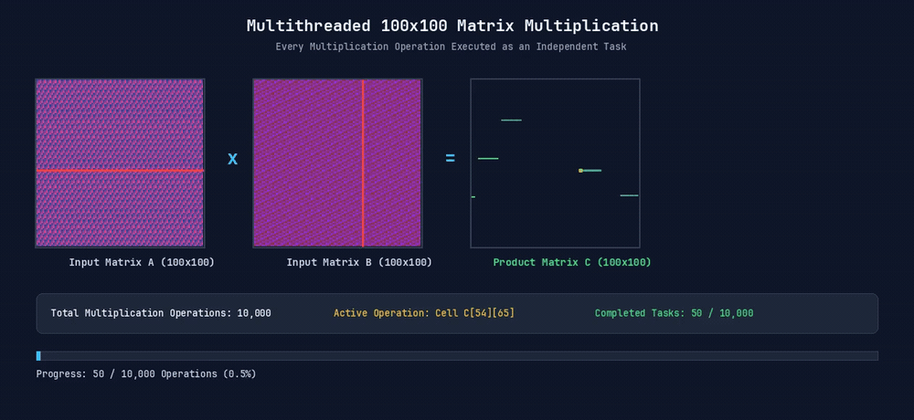

# OS Lab Assignment: Concurrency and Multithreading

[](https://www.java.com/)
[](https://www.python.org/)

Implementation of fundamental Operating Systems concurrency and parallel computing concepts:
1. **Producer-Consumer Synchronization** in Java using Monitor synchronization (`synchronized`, `wait()`, `notifyAll()`) with a bounded circular buffer.
2. **Multithreaded $100 \times 100$ Matrix Multiplication** in Python executing 10,000 cell operations concurrently across CPU worker threads, featuring visual animation generation.

---

## 📁 Repository Structure

```text
├── ProducerConsumer/
│   ├── src/
│   │   └── ProducerConsumer.java       # Java bounded-buffer monitor synchronization
│   ├── .classpath                      # Eclipse IDE classpath configuration
│   └── .project                        # Eclipse IDE project definition
├── matrix_multiplication/
│   ├── matrix_multiplication.py        # Multithreaded 100x100 matrix multiplication
│   ├── matrix_multiplication.gif       # High-definition visual execution animation
│   └── matrix_multiplication_100x100.mp4 # Video render of parallel execution
├── .gitignore                          # Excludes Eclipse .metadata and compiled binaries
└── README.md                           # Documentation and execution guide
```

---

## 1. Producer-Consumer Synchronization (`ProducerConsumer.java`)

### Overview
- **Data Structure**: Circular bounded queue (`CircularStorage`) with a fixed capacity of **4 slots**.
- **Synchronization**: Uses Java intrinsic monitors (`synchronized` methods) with `wait()` and `notifyAll()` to coordinate between producer and consumer threads.
- **Rate Mismatch Demonstration**:
  - **Producer** produces every **180 ms** (fast).
  - **Consumer** consumes every **550 ms** (slow).
  - Demonstrates backpressure and buffer overflow handling when production outpaces consumption.

### Sample Execution Output
```text
Buffer empty, consumer waiting...
Produced 1 -> [1]
Consumed 1 -> []
Produced 2 -> [2]
Produced 3 -> [2, 3]
Consumed 2 -> [3]
Produced 4 -> [3, 4]
Produced 5 -> [3, 4, 5]
Produced 6 -> [3, 4, 5, 6]
Consumed 3 -> [4, 5, 6]
Produced 7 -> [4, 5, 6, 7]
Buffer full, producer waiting...
Consumed 4 -> [5, 6, 7]
Produced 8 -> [5, 6, 7, 8]
Buffer full, producer waiting...
...
Consumed 12 -> []
```

### How to Run

#### In Eclipse IDE:
1. In Eclipse, go to **File** $\rightarrow$ **Open Projects from File System...**
2. Browse to and select the `ProducerConsumer` folder, then click **Finish**.
3. In Package Explorer, expand `src` $\rightarrow$ `(default package)`.
4. Right-click `ProducerConsumer.java` $\rightarrow$ **Run As** $\rightarrow$ **Java Application** (or press `Ctrl + F11`).

#### From Terminal / Command Line:
```bash
javac ProducerConsumer/src/ProducerConsumer.java
java -cp ProducerConsumer/src ProducerConsumer
```

---

## 2. Multithreaded Matrix Multiplication (`matrix_multiplication.py`)

### Overview
- Computes $C = A \times B$ for two $100 \times 100$ matrices.
- Total computation consists of **10,000 independent cell dot-products** ($C[r][c] = \sum_{k=0}^{99} A[r][k] \times B[k][c]$).
- Implemented as an **embarrassingly parallel** workload: all 10,000 cell operations are dispatched to a `ThreadPoolExecutor` and executed concurrently by CPU worker threads.
- Visualizes parallel execution progress in real time and exports animations.

### Visualization Demo



### How to Run

```bash
cd matrix_multiplication

# Install dependencies if needed
pip install pillow

# Run script
python matrix_multiplication.py
```
*(Note: Requires `ffmpeg` installed on your system PATH for video/GIF generation).*

---

## 3. Note on Hardware Acceleration & Concurrency Models

- **CPU Multithreading (This Assignment)**: Dispatches matrix operations across concurrent threads managed by the OS using a thread pool. Ideal for exploring thread scheduling, synchronization, and core utilization.
- **GPU Acceleration (NVIDIA TensorRT / CUDA / Tensor Cores)**: Offloads millions of parallel matrix operations to thousands of dedicated GPU cores, fusing computation layers and using reduced-precision arithmetic (`FP16`/`INT8`) for high-throughput AI inference.
